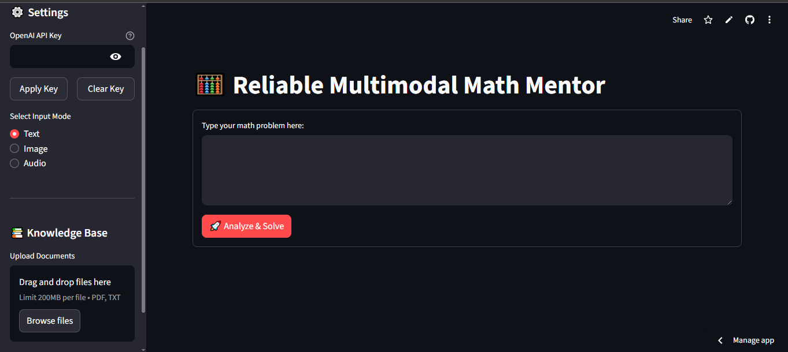
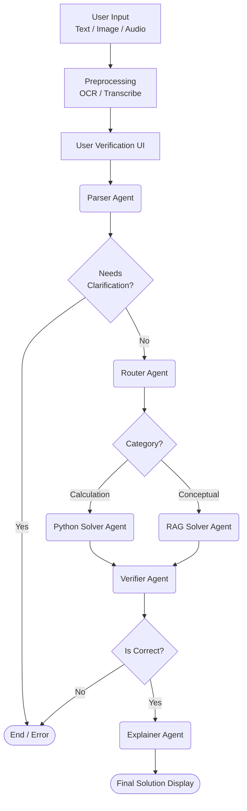

# 🧮 Reliable Multimodal Math Mentor

**Multimodal Math Mentor** is an advanced AI tutoring application designed to solve complex mathematics problems with high reliability. Unlike standard chatbots, this system employs an **Agentic Workflow** (powered by LangGraph) to verify its own logic, execute Python code for precise calculations, and retrieve grounded definitions for conceptual questions.

Built with **Streamlit**, **LangGraph**, **OpenAI GPT-4o**, and **ChromaDB**.

---

## 🚀 Key Features

### 1. 🧠 Intelligent Agentic Workflow
The application uses a state machine (DAG) to orchestrate specialized agents:
*   **Parser Agent:** Extracts specific math topics and identifies ambiguous queries before processing.
*   **Router Agent:** Dynamically decides the solution strategy:
    *   **🐍 Calculation Path:** Routes to a **Python Solver** that writes and executes real Python code (using `numpy`/`math`) to prevent LLM arithmetic hallucinations.
    *   **📚 Conceptual Path:** Routes to a **RAG Solver** that performs vector searches on the Knowledge Base for theorems and definitions.
*   **Verifier Agent:** rigorous self-correction step that checks for domain errors (e.g., dividing by zero), unit mismatches, or logical fallacies.
*   **Explainer Agent:** Synthesizes the verified technical output into a clear, Markdown-formatted educational explanation.

### 2. 👁️🎙️ Multimodal Inputs
*   **Text:** Standard mathematical problem typing.
*   **Vision (OCR):** Upload images (`.jpg`, `.png`). Uses **EasyOCR** to extract mathematical notation from handwritten or printed images.
*   **Audio:** Voice your questions (`.mp3`, `.wav`). Uses **OpenAI GPT-4o-Transcribe** for high-fidelity speech-to-text.

### 3. 📚 Dynamic RAG Knowledge Base
*   **Seed Knowledge:** Pre-loaded with essential mathematical axioms and common student pitfalls.
*   **Custom Ingestion:** Users can upload **PDF** or **TXT** textbooks via the sidebar. These are chunked, embedded (using `text-embedding-3-small`), and stored in **ChromaDB**.
*   **Memory:** Correct, verified solutions are saved to a local JSON file to reinforce learning over time.

---
## Frontend view

```Image

```
---

## 📐 System Architecture

The core of the application is a **LangGraph StateGraph**. Below is the flow of data through the system:



---

## 📂 Project Structure

```text
multimodal-math-mentor/
├── data/                  
│   ├── chroma_db/          # Persistent Vector Database (Chroma)
│   └── problem_memory.json # JSON file storing verified QA pairs
├── src/                   
│   ├── agents.py           # Agent definitions (Parser, Router, Solvers, Verifier)
│   ├── config.py           # Configuration & Dynamic API Key handling
│   ├── graph.py            # LangGraph StateGraph construction
│   ├── processors.py       # Async OCR (EasyOCR) and Audio Transcription
│   └── rag.py              # Embedding generation & Document ingestion logic
├── main.py                 # Streamlit User Interface entry point
├── requirements.txt        # Project dependencies
└── README.md               # Documentation
```

---

## 🛠️ Installation & Setup

### 1. Prerequisites
*   Python 3.9+
*   [OpenAI API Key](https://platform.openai.com/) (Requires access to `gpt-4o`).

### 2. Clone Repository
```bash
git clone https://github.com/Vamshi17one/multimodal-math-mentor.git
cd multimodal-math-mentor
```

### 3. Create Virtual Environment
```bash
# Windows
python -m venv venv
venv\Scripts\activate

# Mac/Linux
python3 -m venv venv
source venv/bin/activate
```

### 4. Install Dependencies
```bash
pip install -r requirements.txt
```

### 5. API Key Configuration
You have two options to set your OpenAI API Key:
1.  **Environment Variable:** Create a `.env` file in the root directory:
    ```ini
    OPENAI_API_KEY=sk-proj-xxxxxxxxxxxxxxxxxxxxxxxx
    ```
2.  **UI Entry:** Enter the key directly in the Streamlit Sidebar under "Settings".

---

## ▶️ Usage Guide

1.  **Run the Application:**
    ```bash
    streamlit run main.py
    ```

2.  **Select Input Mode:**
    *   **Text:** Type your problem directly.
    *   **Image:** Upload a photo of a math problem. Click "Extract Text" to run OCR, edit the result if needed, then solve.
    *   **Audio:** Upload an audio recording. Click "Transcribe" to convert speech to text.

3.  **Knowledge Base (Optional):**
    *   Upload PDF notes or textbooks in the sidebar.
    *   Click "Index Documents" to add them to the RAG system.

4.  **View Logic:**
    *   After a solution is generated, expand the **"🕵️ Agent Logic & Tools"** section to see:
        *   The Python code generated and executed.
        *   The specific document chunks retrieved from the knowledge base.
        *   The Router's decision-making process.

---

## 📦 Tech Stack

*   **Frontend:** Streamlit
*   **Orchestration:** LangGraph, LangChain
*   **LLM:** OpenAI GPT-4o
*   **Vector Store:** ChromaDB
*   **Embeddings:** OpenAI text-embedding-3-small
*   **Vision/OCR:** EasyOCR, Pillow, NumPy
*   **Audio:** OpenAI GPT-4o-Transcribe (via API)

---

## ⚠️ Limitations
*   **Python Execution:** The system uses `exec()` to run generated code. While this enables powerful math solving, it runs locally. In a production environment, this should be sandboxed (e.g., using E2B or Docker).
*   **OCR Accuracy:** Handwriting recognition depends heavily on image clarity and contrast.

---