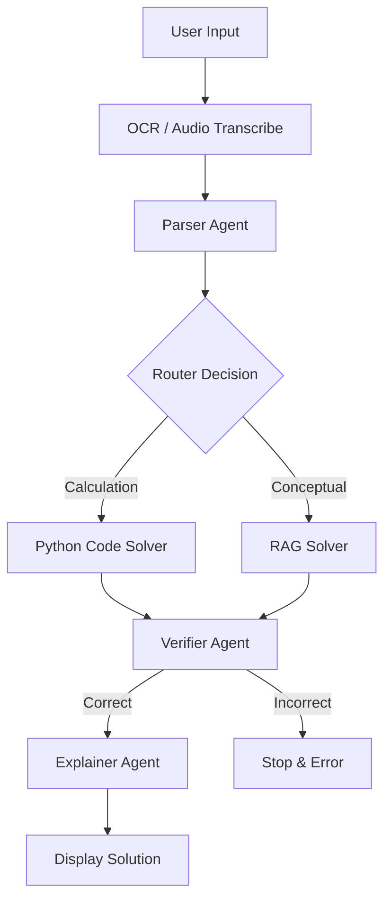

# 🧮 Reliable Multimodal Math Mentor

**Multimodal Math Mentor** is an agentic AI tutoring application designed to solve complex math problems with high reliability. It moves beyond simple LLM text generation by using **LangGraph** to orchestrate specialized agents, **Python Code Execution** for precise calculations, and **RAG (Retrieval-Augmented Generation)** for conceptual grounding.

Built with [Streamlit](https://streamlit.io/), [LangGraph](https://langchain-ai.github.io/langgraph/), and [OpenAI GPT-4o](https://openai.com/).

---

## 🚀 Key Features

### 1. 🧠 Intelligent Agentic Workflow (LangGraph)
Unlike standard chatbots, this system uses a state machine to ensure quality:
*   **Parser Agent:** Extracts the core math topic and identifies ambiguities.
*   **Router Agent:** Dynamically decides the strategy:
    *   **🧮 Calculation Path:** Routes to a **Python Solver** that writes and executes code to prevent LLM arithmetic hallucinations.
    *   **📖 Conceptual Path:** Routes to a **RAG Solver** that retrieves theorems and definitions from the Knowledge Base.
*   **Verifier Agent:** Critiques the solution for domain errors (e.g., dividing by zero) before showing it to the user.
*   **Explainer Agent:** Converts the verified technical answer into a friendly, markdown-formatted tutorial.

### 2. 👁️🎙️ Multimodal Inputs
*   **Text:** Standard problem typing.
*   **Vision (OCR):** Upload images of math problems. Uses **EasyOCR** (with OpenCV/NumPy) to extract text from images.
*   **Audio:** Voice your questions. Uses **OpenAI GPT-4o-Transcribe** model for high-accuracy speech-to-text.

### 3. 📚 Dynamic Knowledge Base (RAG)
*   **Pre-loaded Seeds:** Comes with a curated list of math axioms and common pitfalls.
*   **Custom Ingestion:** Upload PDF or TXT textbooks via the sidebar to expand the AI's knowledge.
*   **Vector Search:** Uses **ChromaDB** and **OpenAI Embeddings** to retrieve relevant context.

### 4. 🛡️ Human-in-the-Loop & Memory
*   **Verification:** Users can edit the OCR/ASR extracted text before the agents begin solving.
*   **Self-Learning:** Correct, user-verified solutions are saved to a local JSON memory file to reinforce learning.

---

## 📐 System Architecture

The application follows a directed cyclic graph (DAG) architecture:



---

## 📂 Project Structure

```text
multimodal-math-mentor/
├── data/                  
│   ├── chroma_db/         # Vector Database storage
│   └── problem_memory.json # Saved verified solutions
├── src/                   
│   ├── agents.py          # AI Agents (Parser, Router, Solvers, Verifier)
│   ├── config.py          # Env vars and Model configs
│   ├── graph.py           # LangGraph StateGraph definition
│   ├── processors.py      # EasyOCR and Audio handling
│   └── rag.py             # ChromaDB and File Ingestion logic
├── main.py                # Streamlit User Interface
├── requirements.txt       # Dependencies
├── .env                   # API Keys
└── README.md              # Documentation
```

---

## 🛠️ Installation & Setup

### 1. Prerequisites
*   Python 3.9+
*   [OpenAI API Key](https://platform.openai.com/) (Access to `gpt-4o` required).

### 2. Clone Repository
```bash
git clone https://github.com/Vamshi17one/multimodal-math-mentor.git
cd multimodal-math-mentor
```

### 3. Virtual Environment
```bash
# Windows
python -m venv venv
venv\Scripts\activate

# Mac/Linux
python3 -m venv venv
source venv/bin/activate
```

### 4. Install Dependencies
```bash
pip install -r requirements.txt
```

<details>
<summary><strong>requirements.txt</strong></summary>

```text
streamlit
langchain
langchain-openai
langchain-community
langchain-core
langgraph
chromadb
openai
pydantic
python-dotenv
pillow
easyocr
numpy
pypdf
```
</details>

### 5. Configuration
Create a `.env` file in the root directory:

```ini
OPENAI_API_KEY=sk-proj-xxxxxxxxxxxxxxxxxxxxxxxx
```

---

## ▶️ Usage Guide

1.  **Run the App:**
    ```bash
    streamlit run main.py
    ```
2.  **Select Input Mode (Sidebar):**
    *   Choose Text, Image, or Audio.
3.  **Add Knowledge (Optional):**
    *   In the sidebar, upload a PDF math chapter.
    *   Click "Index Documents".
4.  **Solve:**
    *   Input your problem.
    *   Review the extracted text.
    *   Click "Solve Problem".
5.  **View Logic:**
    *   Expand the **"🕵️ Agent Logic & Tools"** section in the result to see the generated Python code or the specific RAG documents used.

---

## ⚠️ Limitations
*   **Sandboxing:** The Python solver uses `exec()`. While useful for math, strictly limit this to local/controlled environments.
*   **OCR:** Handwritten math recognition depends heavily on image clarity.

---
